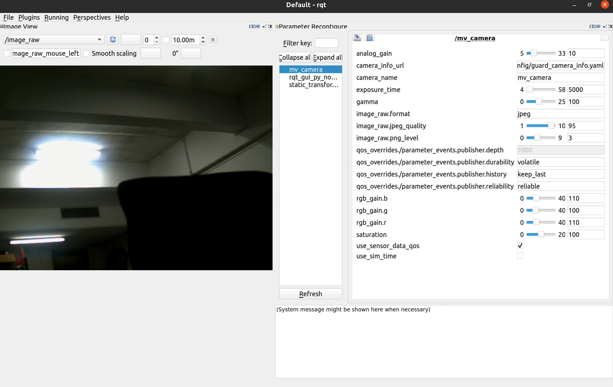

# ros2_mindvision_camera

ROS2 MindVision 相机包，提供了 MindVision 相机的 ROS API。

Only tested under Ubuntu 22.04 with ROS2 Humble


## 使用说明

### Build from source

#### Dependencies

- [Robot Operating System 2 (ROS2)](https://docs.ros.org/en/humble/) (middleware for robotics),

#### Building

To build from source, clone the latest version from this repository into your colcon workspace and compile the package using

 mkdir -p ros_ws/src
 cd ros_ws/src
 git clone <https://github.com/chenjunnn/ros2_mindvision_camera.git>
 cd ..
 rosdep install --from-paths src --ignore-src -r -y
 colcon build --symlink-install --packages-up-to mindvision_camera

### 标定

标定教程可参考 <https://navigation.ros.org/tutorials/docs/camera_calibration.html>

参数意义请参考 <http://wiki.ros.org/camera_calibration>

标定后的相机参数会被存放在 `/tmp/calibrationdata.tar.gz`

### 启动相机节点

#### 单相机模式

    ros2 launch mindvision_camera mv_launch.py

支持的参数：

1. params_file： 相机参数文件的路径
2. camera_info_url： 相机内参文件的路径
3. use_sensor_data_qos： 相机 Publisher 是否使用 SensorDataQoS (default: `false`)

#### 多相机模式

**1. 查看所有连接的相机信息和序列号**:

```bash
ros2 launch mindvision_camera list_cameras_launch.py
```

这将列出所有检测到的相机及其序列号（SN）。

**2. 配置多相机参数**：

编辑 `config/dual_camera_params.yaml` 文件，为每个相机指定序列号：

```yaml
/camera_left:
  ros__parameters:
    camera_name: camera_left
    camera_sn: "YOUR_LEFT_CAMERA_SN"  # 替换为实际序列号
    ...

/camera_right:
  ros__parameters:
    camera_name: camera_right
    camera_sn: "YOUR_RIGHT_CAMERA_SN"  # 替换为实际序列号
    ...
```

**3. 启动多个相机**：

```bash
ros2 launch mindvision_camera dual_camera_launch.py
```

这将同时启动两个相机节点，分别在 `/camera_left` 和 `/camera_right` 命名空间下。

**注意事项：**

- `camera_sn` 参数留空时，节点将使用第一个检测到的相机
- 每个相机必须指定唯一的序列号以避免冲突
- 可以通过修改 launch 文件添加更多相机节点

## 可配置参数

以下参数可以在配置文件（如 `config/camera_params.yaml`）中设置，也可以通过 ROS2 参数服务器动态修改：

| 参数名 | 类型 | 默认值 | 说明 |
|--------|------|--------|------|
| `camera_name` | string | `mv_camera` | 相机名称 |
| `camera_sn` | string | `""` | 相机序列号（留空使用第一个检测到的相机） |
| `image_width` | int | `0` | 图像宽度（0表示使用相机默认分辨率） |
| `image_height` | int | `0` | 图像高度（0表示使用相机默认分辨率） |
| `exposure_time` | int | `5000` | 曝光时间（微秒） |
| `analog_gain` | int | - | 模拟增益 |
| `rgb_gain.r` | int | - | 红色通道增益 |
| `rgb_gain.g` | int | - | 绿色通道增益 |
| `rgb_gain.b` | int | - | 蓝色通道增益 |
| `saturation` | int | - | 饱和度 |
| `gamma` | int | - | 伽马值 |
| `frame_rate` | int | `10` | 帧率（fps，网口相机支持） |
| `frame_speed` | int | `0` | 帧速度模式（USB相机：0=Low, 1=Normal, 2=High, 3=Super） |
| `flip_image` | bool | `false` | 是否翻转图像 |

**分辨率设置说明**：
- 必须同时设置 `image_width` 和 `image_height` 为非零值才会生效
- 如果设置为 0（默认），则使用相机的默认分辨率
- 支持的分辨率范围取决于具体相机型号
- 可以通过 ROS2 参数服务器动态修改分辨率

示例：设置 1920x1080 分辨率
```yaml
ros__parameters:
  image_width: 1920
  image_height: 1080
```

### 通过 rqt 动态调节相机参数

打开 rqt，在 Plugins 中添加 `Configuration -> Dynamic Reconfigure` 及 `Visualization -> Image View`

<!--  -->
